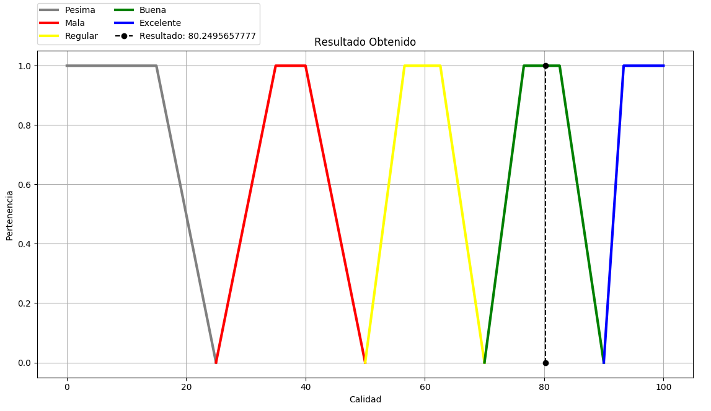

Software para la trata de aguas
===============================

Se trata de un software especialmente desarrollado para la evaluación de la calidad del agua en base a
ciertos parámetros que podemos ingresar en el mismo, los cuales pasan a través de un sistema experto basado
en reglas, el cual puede inferir si la calidad del agua es:

* **Pésima**
* **Mala**
* **Regular**
* **Buena**
* **Excelente**

Test para la calidad del agua
-----------------------------

Esta es la ventana en la que debemos ingresar los parámetros obtenidos a partir de una muestra de agua
previamente tomada.

  

Este es el mensaje que nos muestra el software como salida luego de evaluar los parámetros ingresados en el
sistema experto basado en reglas .

  

Finalmente nos muestra una gráfica en la cual podemos observar los rangos de calidad establecidos para
determinar la calidad del agua, y también podemos observar a cual de estos rangos corresponde el valor obtenido de los cálculos de nuestro sistema experto.

  

